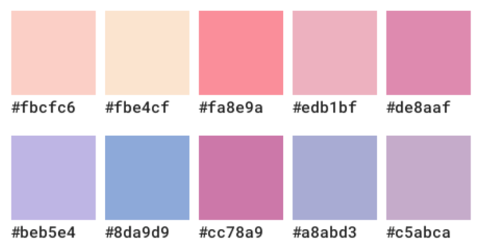

## Pink-harmony
This is the first theme I created for Visual Studio Code, with the purpose of expanding my knowledge about customization and configuration in development environments.

For the design of this theme, I decided to follow the following color palette (along with some variations of these colors): 

My primary focus was to ensure that the colors provided good contrast and a comfortable reading experience.

## Install your extension
To start using your extension with Visual Studio Code copy it into the `<user home>/.vscode/extensions` folder and restart Code. 
Then, inside Visual Studio Code, go to **Manage > Themes > Color Theme**, and look for the newly added theme in the list.